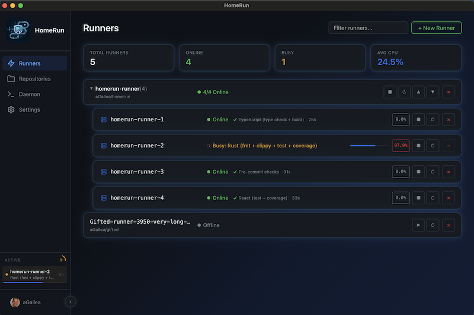
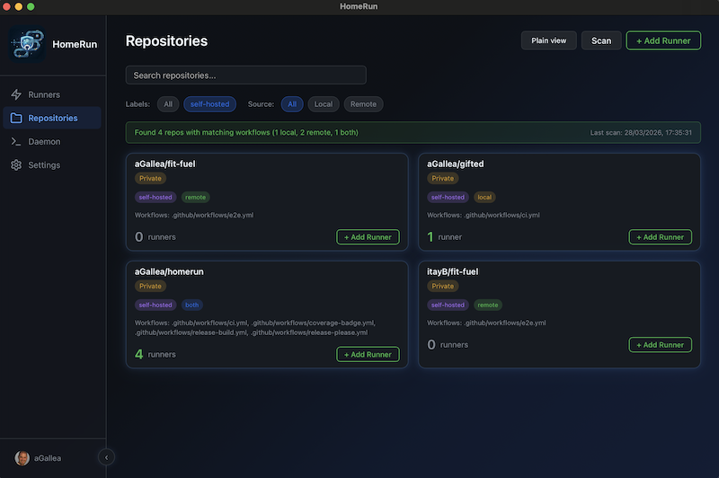
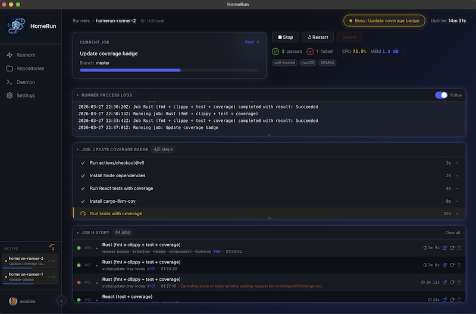
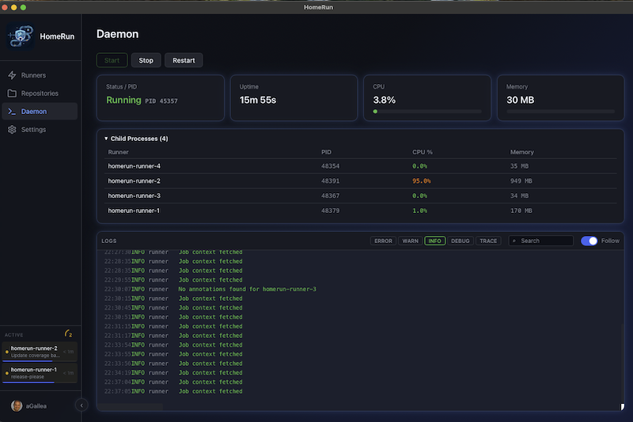
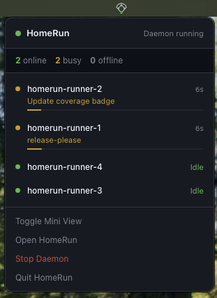
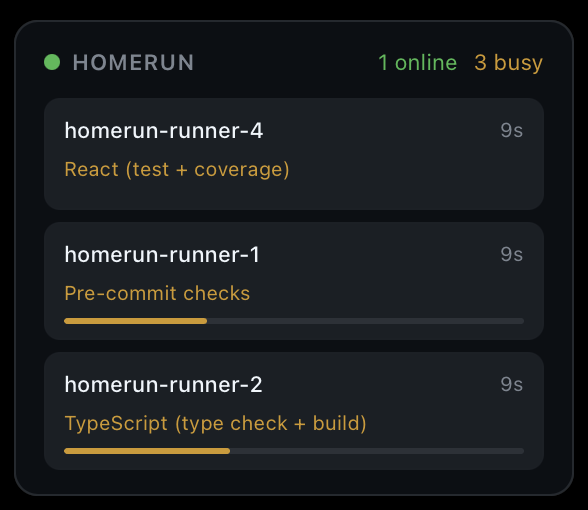
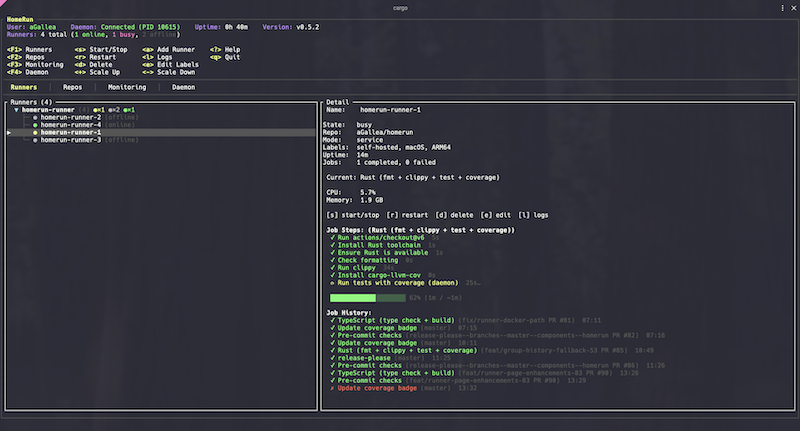

<h3 align="center">
  <a name="readme-top"></a>
  
</h3>

<h1 align="center">HomeRun</h1>

<p align="center">
  <strong>One-click GitHub Actions self-hosted runners for macOS & Windows</strong>
</p>

<p align="center">
  <a href="#readme">
    
  </a>
  <a href="docs/ARCHITECTURE.md">
    
  </a>
  <a href="docs/SELF_HOSTED_RUNNERS.md">
    
  </a>
</p>

<div align="center">
  <a href="https://github.com/aGallea/homerun/actions/workflows/ci.yml">
    
  </a>
  
  <a href="LICENSE">
    
  </a>
  <a href="https://github.com/aGallea/homerun/releases/latest">
    
  </a>
  <a href="https://www.rust-lang.org/">
    
  </a>
  
  
</div>

---

HomeRun replaces the manual GitHub self-hosted runner setup process with a unified desktop app and terminal UI. Authenticate with GitHub once, pick a repository, and launch runners with a single click. HomeRun handles download, registration, process management, log streaming, and resource monitoring — everything the official docs make you do by hand.

HomeRun runs on **macOS** and **Windows**, with Linux support planned.

## Features

- **One-click runner setup** — no shell scripts, no copy-pasting tokens
- **Device Flow authentication** — log in with your GitHub account via browser; no PAT required
- **Batch runner creation** — spin up multiple runners for the same repo in one step with live progress
- **Unified dashboard** — monitor all runners across all repos in one place
- **Live log streaming** — tail runner output in real time from the runner detail view
- **Job tracking** — current job progress with step-by-step status, estimated completion, and full job history per runner
- **Real-time metrics** — CPU/RAM per runner via live WebSocket updates
- **Two run modes** — app-managed (daemon child) or background service (launchd)
- **Auto-restart** — crashed runners recover automatically (up to 3 attempts)
- **Smart repo discovery** — scan local workspace directories or your GitHub account for repos that use self-hosted runners
- **Terminal UI** — k9s-inspired TUI with info header, context-sensitive keybindings (F1-F4 tabs), repo search, and in-app login via Device Flow
- **CLI mode** — scriptable `homerun --no-tui` commands with colored output for automation
- **Cross-platform** — macOS (launchd auto-start, native notifications) and Windows (Task Scheduler auto-start, named pipe IPC)
- **Pre-commit hooks** — enforces `cargo fmt`, `cargo clippy`, conventional commits, and Prettier on every commit

## Architecture

```
┌──────────────┐    ┌─────────┐
│  Tauri App   │    │   TUI   │     (thin clients)
└──────┬───────┘    └────┬────┘
       └────────┬────────┘
                │ IPC (REST + SSE + WebSocket)
       ┌────────┴────────┐
       │   homerund      │     (daemon — Unix socket or Windows named pipe)
       └────────┬────────┘
                │ spawns / monitors
      ┌─────────┼─────────┐
      │         │         │
   ┌──┴──┐   ┌──┴──┐   ┌──┴──┐
   │Run 1│   │Run 2│   │Run N│   (GitHub Actions runner processes)
   └─────┘   └─────┘   └─────┘
```

Runners are native child processes of the daemon — not Docker containers. Each runner is an instance of the [official GitHub Actions runner binary](https://github.com/actions/runner). All GitHub communication is outbound HTTPS. No inbound ports needed.

For the full architecture deep-dive (runner lifecycle, state machine, process management, auth flow), see [docs/ARCHITECTURE.md](docs/ARCHITECTURE.md).

New to self-hosted runners? See [How Self-Hosted Runners Work](docs/SELF_HOSTED_RUNNERS.md) for a primer on runner communication, permissions, security considerations, and what HomeRun automates.

## Quick Start

### Install (macOS — DMG)

1. Download the latest `.dmg` for your architecture from [Releases](https://github.com/aGallea/homerun/releases):
   - **Apple Silicon** (M1/M2/M3/M4): `HomeRun_<version>_aarch64.dmg`
   - **Intel**: `HomeRun_<version>_x86_64.dmg`
2. Open the `.dmg` and drag HomeRun to Applications
3. Remove the macOS quarantine flag (required because the app is not yet code-signed):

   ```sh
   xattr -cr /Applications/HomeRun.app
   ```

4. Launch HomeRun — go to Settings > Startup > "Launch at login" to auto-start the daemon

The `.dmg` bundles the `homerund` daemon inside the app. Releases are automated via [release-please](https://github.com/googleapis/release-please) — every merge to `master` with conventional commits triggers a Release PR with version bumps and changelog.

### Install (macOS — Homebrew)

```sh
brew tap aGallea/homerun

# CLI tools (homerun + homerund)
brew install homerun

# Desktop app (not code-signed — remove quarantine after install)
brew install --cask homerun
xattr -cr /Applications/HomeRun.app
```

### Install (Windows — MSI)

1. Download `HomeRun_<version>_x64-setup.msi` from [Releases](https://github.com/aGallea/homerun/releases)
2. Run the installer — it installs HomeRun and the `homerund` daemon
3. Launch HomeRun from the Start Menu — go to Settings > Startup > "Launch at login" to auto-start the daemon via Task Scheduler

### Build from Source

**Prerequisites:** Rust 1.75+ ([rustup.rs](https://rustup.rs)), Node.js 20+. On macOS: Xcode Command Line Tools (`xcode-select --install`). On Windows: Visual Studio Build Tools with C++ workload.

```sh
git clone https://github.com/aGallea/homerun.git
cd homerun
```

**macOS:**
```sh
make setup        # checks prerequisites, builds daemon + TUI, installs frontend deps
```

**Any platform (manual build):**
```sh
# Daemon + TUI
cargo build --release -p homerund -p homerun

# Desktop app (requires Node.js)
cd apps/desktop && npm install && npm run tauri build
```

### Run

```sh
# Start the daemon (required by both the TUI and desktop app)
make dev                # or: ./target/release/homerund

# Launch the TUI (in another terminal)
make tui                # or: ./target/release/homerun

# Launch the desktop app (in another terminal)
make desktop            # or: cd apps/desktop && npm run tauri dev

# CLI mode (no interactive UI — useful for scripts)
homerun --no-tui list
```

> **Note:** The desktop app's DMG release bundles the daemon inside the app. When building from source, start the daemon separately before launching the desktop app.

Run `make help` to see all available commands.

## Screenshots

### Desktop App

<p align="center">
  
</p>
<p align="center"><em>Runners dashboard — live status, CPU usage, and job progress at a glance</em></p>

<p align="center">
  
</p>
<p align="center"><em>Repository scanning — find repos that use self-hosted runners across local and remote sources</em></p>

<p align="center">
  
</p>
<p align="center"><em>Runner detail — live job steps, log streaming, and full job history</em></p>

<p align="center">
  
</p>
<p align="center"><em>Daemon view — child processes, resource usage, and live daemon logs</em></p>

### Menu Bar & Mini View

<p align="center">
  
  &nbsp;&nbsp;&nbsp;&nbsp;
  
</p>
<p align="center"><em>Menu bar with runner status &nbsp;|&nbsp; Mini view for quick monitoring</em></p>

### Terminal UI

<p align="center">
  
</p>
<p align="center"><em>TUI — k9s-inspired keyboard-driven interface with runner details and job history</em></p>

## CLI Usage

The `--no-tui` flag disables the interactive terminal UI and prints plain text output instead. This is useful for scripting, automation, and quick status checks.

```sh
# List all runners with status, mode, and CPU usage
homerun --no-tui list

# Show overall status (daemon, auth, runner counts, system metrics)
homerun --no-tui status

# Scan a local workspace for repos using self-hosted runners
homerun --no-tui scan ~/workspace

# Scan your GitHub repos remotely (requires authentication)
homerun --no-tui scan --remote

# Combine local and remote scanning
homerun --no-tui scan ~/workspace --remote

# Manage the daemon
homerun --no-tui daemon start
homerun --no-tui daemon stop
homerun --no-tui daemon restart
```

## Tech Stack

| Component          | Technology                                              |
| ------------------ | ------------------------------------------------------- |
| Daemon             | Rust + Axum (async HTTP/SSE/WebSocket over Unix socket / Windows named pipe) |
| TUI / CLI          | Rust + Ratatui + Clap                                                        |
| Desktop app        | Tauri 2.0 + React + TypeScript                                               |
| Process management | `tokio::process` + `sysinfo`                                                 |
| GitHub API         | `octocrab` crate                                                             |
| Auth token storage | File-based (`~/.homerun/auth.json`)                                          |
| Log streaming      | Server-Sent Events (SSE)                                                     |
| Real-time updates  | WebSocket                                                                    |
| Auto-start         | macOS launchd / Windows Task Scheduler                                       |
| Notifications      | macOS native (`mac-notification-sys`)                                        |

## Roadmap

| Feature                          | Description                                                                            | Issue                                                 |
| -------------------------------- | -------------------------------------------------------------------------------------- | ----------------------------------------------------- |
| Live log streaming               | Capture runner step logs locally for fully real-time job progress                      | [#44](https://github.com/aGallea/homerun/issues/44)   |
| Docker runners                   | Run runners inside containers — isolated environments, resource limits, ephemeral mode | [#84](https://github.com/aGallea/homerun/issues/84)   |
| Kubernetes backend               | Manage runners as pods in a K8s cluster                                                | [#89](https://github.com/aGallea/homerun/issues/89)   |
| Cross-platform (Linux)           | Extend to Linux (systemd auto-start, packaging)                                       | [#112](https://github.com/aGallea/homerun/issues/112) |
| Organization-level runners       | Manage runners at the GitHub org level, not just per-repo                              | —                                                     |

Priorities depend on user interest — if a feature would be useful to you, drop a thumbs-up on the issue.

## Requirements

**macOS:**
- macOS 13+ (Ventura or later)
- ARM64 or Intel Mac

**Windows:**
- Windows 10 or later
- x64

**Both platforms:**
- A GitHub account

## FAQ / Troubleshooting

<details>
<summary><strong>Daemon won't start / "socket already exists"</strong></summary>

**macOS/Linux:** A stale socket file may exist from a previous crash. Remove it and try again:

```sh
rm ~/.homerun/daemon.sock
homerund
```

**Windows:** Named pipes are cleaned up automatically when the process exits. If the daemon reports the pipe is active, another instance may still be running. Check with `tasklist | findstr homerund`.

</details>

<details>
<summary><strong>Authentication fails / "token expired"</strong></summary>

Re-authenticate by running the Device Flow login again from the TUI or desktop app. If you're using a PAT, ensure it has the `repo` and `admin:org` scopes. You can also clear the stored token from macOS Keychain:

```sh
security delete-generic-password -s "homerun" -a "github_token"
```

</details>

<details>
<summary><strong>Runner stuck in "Registering" state</strong></summary>

This usually means the GitHub API registration token request failed or timed out. Check:

1. Your GitHub token is valid and has the `repo` scope
2. You have admin access to the target repository (required by GitHub to register self-hosted runners)
3. The repository hasn't hit the [self-hosted runner limit](https://docs.github.com/en/actions/hosting-your-own-runners/managing-self-hosted-runners/about-self-hosted-runners#self-hosted-runner-limits)

Stop the runner and try creating a new one.

</details>

<details>
<summary><strong>Runner exits immediately after starting</strong></summary>

Check the runner logs in `~/.homerun/logs/` for details. Common causes:

- Another runner is already using the same work directory
- The runner binary is corrupted — delete `~/.homerun/cache/` to force a fresh download
- macOS Gatekeeper is blocking the runner binary — run `xattr -cr ~/.homerun/cache/`

</details>

<details>
<summary><strong>Desktop app shows "Cannot connect to daemon"</strong></summary>

The daemon must be running before launching the desktop app or TUI. Start it with:

```sh
homerund
```

Or enable "Launch at login" in Settings > Startup to have it start automatically (via launchd on macOS, Task Scheduler on Windows).

</details>

<details>
<summary><strong>"Background Items Added" notification with cryptic name</strong></summary>

macOS Ventura+ shows a "Background Items Added" notification when HomeRun registers the daemon as a background service. Since the app is not yet code-signed, macOS displays a hash identifier instead of "HomeRun". This is cosmetic and doesn't affect functionality.

You can manage background items in **System Settings > General > Login Items & Extensions**.

Code signing is tracked in [#49](https://github.com/aGallea/homerun/issues/49) — once resolved, the notification will show "HomeRun" properly.

</details>

## Contributing

See [CONTRIBUTING.md](CONTRIBUTING.md) for how to set up the dev environment, coding standards, and the PR process.

## License

[MIT](LICENSE) © 2026 aGallea
