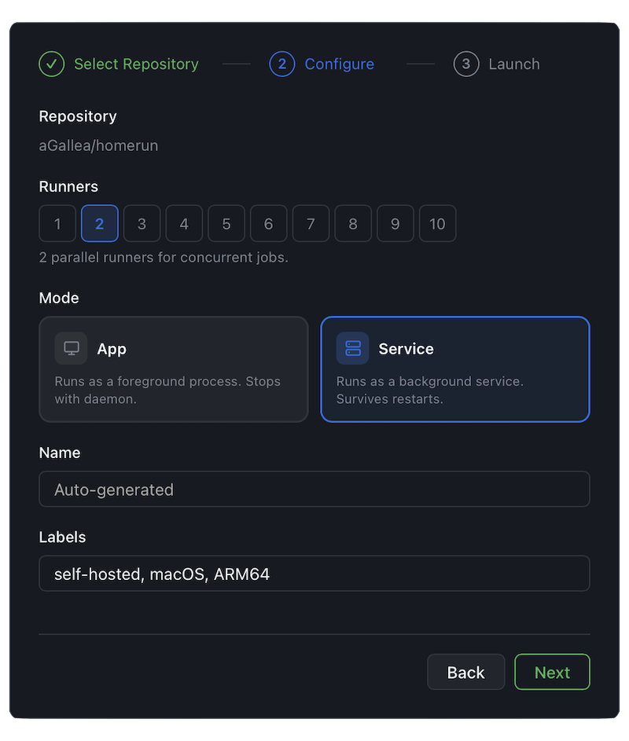

# I Was Tired of Babysitting GitHub Actions Runners — So I Built HomeRun

## How I replaced shell scripts and copy-paste rituals with a desktop app and a daemon


---

If you've ever set up a GitHub Actions self-hosted runner, you know the drill:

1. Go to repo Settings → Actions → Runners → New self-hosted runner
2. Copy a download URL
3. Paste it into a terminal
4. Extract the tarball
5. Copy a registration token
6. Run `config.sh` with the right flags
7. Run `run.sh`
8. Pray it doesn't die overnight

Now multiply that by 4 runners across 6 repos. Add monitoring. Add restarts for the ones that crash at 3 AM.

I got tired of this. So I built **HomeRun**.

---

## What Is HomeRun?

HomeRun is an open-source macOS desktop app for managing GitHub Actions self-hosted runners. Behind the scenes, a lightweight daemon handles the entire runner lifecycle — downloading binaries, registering with GitHub, spawning processes, monitoring health, and auto-restarting on failure.

You interact with it through a **native desktop app** built with Tauri and React. Point, click, and your runners are up. No shell scripts, no copy-pasting tokens, no babysitting.


_The compact Mini View — a floating panel that shows runner status and job progress at a glance._

Prefer the terminal? HomeRun also ships with a **TUI** built with Ratatui — full runner management and job tracking without leaving your terminal. There's also a CLI mode for scripting and automation.


_The terminal UI — same features, keyboard-driven._

---

## The Problem with Self-Hosted Runners

GitHub Actions is great. Self-hosted runners are powerful — they let you run CI on your own hardware, access private networks, use specific architectures, and avoid per-minute billing.

But the **management experience** is stuck in 2019:

| What you need to do              | GitHub's solution                       |
| -------------------------------- | --------------------------------------- |
| Set up a runner                  | Copy-paste 6 shell commands from the UI |
| Monitor runner health            | Check the Settings page manually        |
| See live logs                    | SSH into the machine and `tail -f`      |
| Restart a crashed runner         | Hope you set up a systemd service       |
| Scale to multiple runners        | Repeat everything N times               |
| Track which runner ran which job | Good luck                               |

No unified dashboard. No real-time observability. No simple way to scale.

---

## How HomeRun Fixes This

### 1. A Guided Wizard for Creating Runners

No terminal required. Open the app, click "New Runner," and a step-by-step wizard walks you through it:

1. **Select Repository** — pick from your GitHub repos (auto-discovered)
2. **Configure** — set name, labels, count, and launch mode
3. **Launch** — click and your runners are live

Want 4 runners for a repo? Set the count to 4 and hit launch. Done.


_The runner wizard — select a repo, set the count, pick App or Service mode, and launch._

### 2. Browser-Based Authentication

No more generating Personal Access Tokens and pasting them around. HomeRun uses GitHub's Device Flow — it opens your browser, you authorize, and the token is stored securely in your macOS Keychain.

### 3. Real-Time Dashboard

The desktop app gives you a single pane of glass across all your runners and repos:

- **Live status** — Online, Busy, Offline, Error — updated in real time via WebSocket
- **Current job** — Which workflow and job is running right now
- **CPU & RAM** — Per-runner resource usage with live metrics
- **Stats cards** — Total runners, online count, busy count, average CPU at a glance
- **Runner groups** — Batch operations (start, stop, restart, scale) on groups of runners


_System metrics, runner processes, and daemon health — all in one view._

### 4. Deep Runner Inspection

Click any runner to drill into its detail page:

- **Job history** — See past jobs with step-level progress
- **Job steps** — Watch CI steps complete in real time with a progress indicator
- **Resource metrics** — CPU and memory over time
- **Runner controls** — Start, stop, restart, delete — right from the UI


_Drill into any runner — live logs, job steps with progress, and controls._

### 5. Auto-Restart & Self-Healing

Runners crash. It happens. HomeRun detects failures and automatically restarts runners with exponential backoff. For even more resilience, you can launch runners as macOS `launchd` services — they survive reboots without any extra setup.

### 6. Smart Repo Discovery

Not sure which of your repos use self-hosted runners? HomeRun scans your GitHub repos and local workspace to find workflows with `runs-on: self-hosted`, so you know exactly where you need runners.


_Auto-discovered repos with self-hosted runner workflows — add runners directly from here._

### 7. Custom Labels for Job Routing

Tag runners with labels and route specific jobs to specific machines. Create a group of `unit` runners and a group of `e2e` runners, then target them in your workflow:

```yaml
jobs:
  unit-tests:
    runs-on: [self-hosted, unit]
  e2e-tests:
    runs-on: [self-hosted, e2e]
```

---

## Architecture

HomeRun is written entirely in **Rust**, designed as a lightweight daemon that runs 24/7 without hogging resources.

```
┌──────────────┐    ┌─────────┐
│  Desktop App │    │   TUI   │     ← thin clients
└──────┬───────┘    └────┬────┘
       └────────┬────────┘
                │  Unix socket (REST + SSE + WebSocket)
       ┌────────┴────────┐
       │    homerund     │     ← daemon @ ~/.homerun/daemon.sock
       └────────┬────────┘
                │  spawns & monitors
      ┌─────────┼─────────┐
      │         │         │
   ┌──┴──┐   ┌──┴──┐   ┌──┴──┐
   │Run 1│   │Run 2│   │Run N│  ← native GitHub Actions runners
   └─────┘   └─────┘   └─────┘
```

Why this matters:

- **Unix socket** — No open ports, no network exposure. Communication stays local.
- **Real-time updates** — WebSocket for state updates. No polling.
- **Native child processes** — Runners aren't containerized. Full access to host tools, hardware, and file system.
- **Secure token storage** — Credentials live in macOS Keychain, not in plaintext config files.
- **Menu bar integration** — A tray icon shows runner status at a glance, with a compact panel for quick actions.


_The menu bar tray icon — daemon status, runner overview, and quick actions without opening the full app._

---

## Before & After

Here's what managing 4 runners for a repo looks like.

### Before (manual)

```sh
# Download
mkdir runner1 && cd runner1
curl -o actions-runner.tar.gz -L https://github.com/actions/runner/releases/...
tar xzf actions-runner.tar.gz

# Register (copy token from GitHub UI)
./config.sh --url https://github.com/owner/repo --token AXXXXXXXXXXXX --name runner1

# Start
./run.sh &

# Repeat 3 more times...
# Then figure out monitoring, restarts, log access...
```

**~60 manual steps for 4 runners. No monitoring. No auto-restart.**

### After (HomeRun)

Open the app → New Runner → select repo → set count to 4 → Launch.

**One wizard. Full monitoring. Auto-restart. Job tracking.**

---

## Who Is This For?

- **DevOps & Platform engineers** who manage runner fleets and want a dashboard instead of SSH sessions
- **Teams running private CI** who need self-hosted runners without the operational overhead
- **Open source maintainers** who run tests on specific hardware (Apple Silicon, GPUs, etc.)
- **Cost-conscious teams** looking to reduce GitHub Actions spend
- **macOS developers** who need native CI with Keychain integration and launchd support

---

## Getting Started

HomeRun is open source under the MIT license.

```sh
brew tap aGallea/tap
brew install homerun
```

Since HomeRun isn't distributed through the App Store, macOS Gatekeeper may block the app on first launch. Clear the quarantine flag:

```sh
xattr -cr /Applications/HomeRun.app
```

Then start the daemon, launch the desktop app, and authenticate through your browser. Your first runner is a few clicks away.

Or build from source:

```sh
git clone https://github.com/aGallea/homerun.git
cd homerun
cargo run -p homerund   # start daemon
```

Check out the [GitHub repo](https://github.com/aGallea/homerun) for full docs and contribution guidelines.

---

## What's Next

HomeRun is a side project, so the roadmap depends on the time I have, interest from users, and real-world need. That said, here's what I'm thinking about:

- **Live log streaming** ([#44](https://github.com/aGallea/homerun/issues/44)) — Capture runner step logs locally instead of fetching from the GitHub API, making the job progress view fully real-time
- **Docker runners** ([#84](https://github.com/aGallea/homerun/issues/84)) — Run runners inside containers for clean, isolated, reproducible environments with resource limits and ephemeral mode
- **Kubernetes backend** ([#89](https://github.com/aGallea/homerun/issues/89)) — Manage runners as pods in a K8s cluster, turning HomeRun into a lightweight runner controller
- **Cross-platform support** ([#112](https://github.com/aGallea/homerun/issues/112)) — Extending beyond macOS to Linux and Windows
- **Organization-level runners** — Manage runners at the GitHub org level, not just per-repo

If any of these would be useful to you, drop a thumbs-up on the issue — it helps me prioritize.

---

## Try It, Break It, Improve It

HomeRun started as a personal itch-scratch project and grew into something I use every day. If you manage self-hosted GitHub Actions runners — or you've been avoiding self-hosted because of the setup pain — give it a try.

If you find it useful, a **star on the repo** really helps with visibility — it's a solo side project, so every bit of traction counts. **Open an issue** if something breaks. **Send a PR** if you want to help.

**[github.com/aGallea/homerun](https://github.com/aGallea/homerun)**

---

_HomeRun is open source (MIT license) and built with Rust, Tauri, React, and Ratatui. Contributions welcome._
